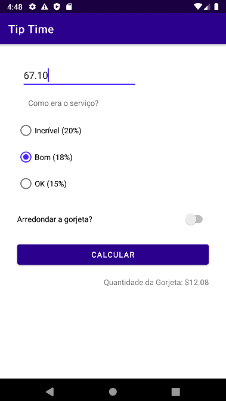

# Tip Time

O Tip Time é um aplicativo feito com o intuito de aprendizado na disciplina de Programação de Aplicativos Mobile I (PdAMI).
O aplicativo consiste em uma calculadora de gorjetas, com porcentagens para um atendimento Incrível (20%), Bom(18%) e Ok(15%), podendo escolher também arredondar as gorjetas).

## Imagens do aplicativo

   

## Linguagem utilizada

Kotlin

